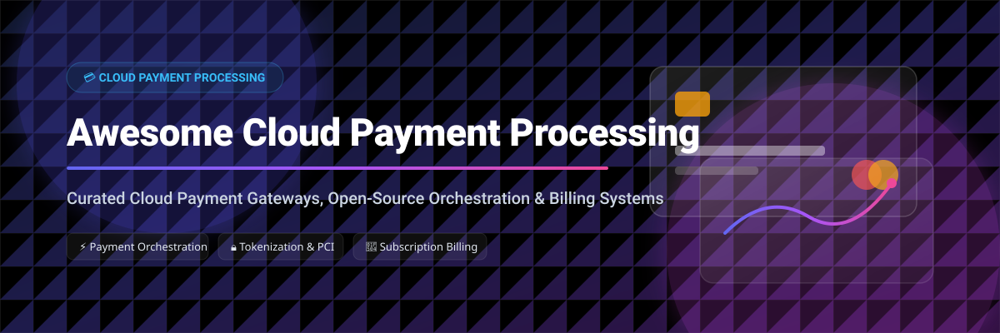

# Awesome-Cloud-Payment-Processing

# Awesome-Cloud-Payment-Processing 💳 ☁️

  

  

  

  

  

  

  

---

## 🌟 Top Cloud Payment Processing Ecosystem

**Curated List of Commercial Payment Platforms & Open-Source Payment Orchestration Tools**  

*Focused on Payment Orchestration, Tokenization, Recurring Billing, Multi-Processor Routing & Self-Hosted Payment Infrastructure*

**Last updated: October 2026** 📅

---

### 📌 Overview & SEO Summary

Welcome to the ultimate curated directory of **cloud payment processing platforms**, **open-source payment orchestration engines**, and **billing automation frameworks**. Whether you are looking for enterprise-grade commercial solutions (such as *Stripe*, *Adyen*, and *Checkout.com*), or self-hostable open-source alternatives (like *Hyperswitch*, *BTCPay Server*, and *Kill Bill*), this list covers category leaders, intelligent routing, and privacy-respecting payment infrastructure.

**Key Market Context:**

- **Hyperswitch** (Juspay) has emerged as the leading open-source payment orchestration platform with **36,000+ GitHub stars**, processing **300M+ daily transactions** for enterprises like Amazon and Agoda .

- **BTCPay Server** provides **zero-fee, self-hosted Bitcoin payments** with **1M+ direct GitHub downloads** and **$73M+ processed** by Namecheap alone .

- **Kill Bill** and **Paymenter** offer open-source billing and subscription management for SaaS and hosting businesses .

---

## 📑 Table of Contents

- [🏢 SaaS & Commercial Platforms](#-saas--commercial-platforms)

- [🔓 Open-Source GitHub Projects](#-open-source-github-projects)

- [🛠️ How to Contribute](#%EF%B8%8F-how-to-contribute)

- [📊 Star History](#-star-history)

- [🤝 Support & Sponsorship](#-support--sponsorship)

- [⚠️ Disclaimer](#%EF%B8%8F-disclaimer)

---

## 🏢 SaaS / Commercial Platforms

The cloud payment processing market is dominated by **full-stack payment platforms** (Stripe, Adyen, Checkout.com) that provide merchant accounts, gateways, and risk management as a unified service, and **payment orchestration layers** (Hyperswitch Cloud, Spreedly) that connect to multiple processors. **Stripe** charges **2.9% + $0.30 per transaction** for standard cards, with **Stripe Billing** adding **0.5–0.8%** for subscription management. **Adyen** uses **interchange++ pricing** with a **€0.11 per transaction** processing fee. **Checkout.com** offers **custom interchange++ pricing** with no monthly fees. **PayPal Braintree** charges **2.59% + $0.49** for standard transactions. **Authorize.Net** charges **$25/month** plus **2.9% + $0.30 per transaction**. **Square** charges **2.6% + $0.10** for in-person and **2.9% + $0.30** for online. **AWS Payment Gateway** uses **consumption-based pricing** integrated with AWS services.

| SaaS / Commercial Platform | Company / Owner | Valuation / Market Cap | Standard Edition Starting Price | Free Tier / Free Trial Limits | Description |

| :--- | :--- | :--- | :--- | :--- | :--- |

| **[Stripe](https://stripe.com/)** 💳 | Stripe Inc. | ~$70 Billion | **2.9% + $0.30** per transaction; Billing adds **0.5–0.8%** | **No monthly fee**; test mode free forever | **Developer-first payment platform** — **Payment Intents API**, **Stripe Billing** for subscriptions, **Radar** for fraud prevention, **Connect** for marketplaces. **The most widely integrated payment processor** globally . |

| **[Adyen](https://www.adyen.com/)** 🌍 | Adyen N.V. | ~$50 Billion (Public) | **Interchange++** with **€0.11** per transaction | **No setup fees**; test environment available | **Enterprise payment platform** — **Unified commerce** across online, in-store, and mobile. **RevenueAccelerate** for authorization optimization. **Risk management** with machine learning . |

| **[Checkout.com](https://www.checkout.com/)** 🎯 | Checkout.com | ~$40 Billion | **Interchange++** with custom processing fees | **No monthly fees**; sandbox available | **Enterprise payment processing** — **Direct connections** to card networks for higher authorization rates. **Risk management**, **dispute management**, and **payouts** . |

| **[PayPal Braintree](https://www.braintreepayments.com/)** 🔵 | PayPal Holdings | ~$80 Billion | **2.59% + $0.49** per transaction | **No monthly fee**; sandbox available | **PayPal-owned payment gateway** — **Drop-in UI** for cards, PayPal, Venmo, and digital wallets. **Recurring billing** and **fraud tools** included . |

| **[Authorize.Net](https://www.authorize.net/)** 🏢 | Visa Inc. | ~$500 Billion | **$25/month** + **2.9% + $0.30** per transaction | **30-day free trial** | **Visa-owned payment gateway** — **Recurring billing**, **Customer Information Manager (CIM)** for stored payment methods. **Advanced fraud detection** suite . |

| **[Square](https://squareup.com/)** ⬜ | Block Inc. | ~$40 Billion | **2.6% + $0.10** (in-person); **2.9% + $0.30** (online) | **Free card reader** with signup | **Omnichannel payment platform** — **Hardware and software** for in-person payments. **Online store** and **invoicing** included. **Instant transfers** available . |

| **[Worldpay](https://www.worldpay.com/)** 🌐 | FIS Global | ~$40 Billion (FIS) | **Custom interchange++ pricing** | **No setup fees**; demo available | **Enterprise payment processing** — **Global reach** with local acquiring in 120+ currencies. **Fraud prevention** and **chargeback management** . |

| **[Fiserv](https://www.fiserv.com/)** 🔷 | Fiserv Inc. | ~$90 Billion | **Custom enterprise pricing** | **Demo available** | **Financial services technology** — **Clover** for SMB payments, **Carat** for enterprise omnichannel. **Integrated payments** with core banking . |

| **[Cybersource](https://www.cybersource.com/)** 🛡️ | Visa Inc. | ~$500 Billion | **Custom enterprise pricing** | **Test environment available** | **Visa-owned payment management** — **Fraud Management** with Decision Manager, **Payment Security** with tokenization. **Global acquiring** connections . |

| **[AWS Payment Gateway](https://aws.amazon.com/payment-cryptography/)** ☁️ | Amazon | ~$2.0 Trillion | **Consumption-based** for underlying AWS services | **Free tier for some services** | **AWS-native payment infrastructure** — **AWS Payment Cryptography** for PCI PIN and P2PE compliance. **AWS Lambda** and **API Gateway** for custom payment processing . |

---

## 🔓 Open-Source GitHub Projects

*Sorted by GitHub_Stars_Count (Descending)* 🌟

- **[Hyperswitch](https://github.com/juspay/hyperswitch)**   

  **Open-source payment orchestration platform**, Apache-2.0 licensed. **36,000+ GitHub stars** — the **most popular open-source payment infrastructure project** . **Built in Rust** for performance and reliability, supporting **~10K TPS peak loads** . **100+ payment processor connectors** with zero development effort, enabling **150+ payment methods** . **Intelligent routing** dynamically switches between processors for optimal auth rates and minimal cost. **PCI-compliant vault** for card tokenization without PCI DSS burden on merchants . **Smart retries**, **revenue recovery**, **cost observability**, and **reconciliation** as standalone modules . **Self-host with enterprise support**, **self-host with outsourced PCI**, or **SaaS** via Juspay . Used by **Amazon, Agoda, Zurich** and 400+ enterprises . **The "Linux of payments"** — transparent, adaptable, merchant-controlled . 🚀

- **[BTCPay Server](https://github.com/btcpayserver/btcpayserver)**   

  **Self-hosted, open-source cryptocurrency payment processor**, MIT licensed. **2,571 GitHub stars** with **1M+ direct downloads** . **Zero fees, no middlemen, no KYC** — direct peer-to-peer payments . **Full Bitcoin node with Lightning Network and Liquid Network support** . **30+ plugins** for e-commerce (WooCommerce, Shopify), point-of-sale, and swaps . **Namecheap processed $73M+ through BTCPay** with **1.1M transactions from 500K+ users across 200 countries** . **Set a world record for Bitcoin transactions in 8 hours** (4,187 transactions at Bitcoin 2025) . **The backbone of Bitcoin commerce** — used on every continent except Antarctica . 🟠

- **[Kill Bill](https://github.com/killbill/killbill)**   

  **Open-source subscription billing and payment platform**, Apache-2.0 licensed. **Fair vitality score** on LFX Insights . **Subscription management**, **invoicing**, **payment processing**, and **analytics** in a unified platform. **Plugin architecture** for extensibility. **Java-based with REST APIs**. **The most mature open-source billing engine** for SaaS and digital services . 📊

- **[Paymenter](https://github.com/Paymenter/Paymenter)**   

  **Open-source billing platform for hosting companies**, MIT licensed. **528 GitHub stars** with **Excellent - Partial vitality score** . **Automates subscriptions**, eliminates billing chaos, and grows hosting businesses **without vendor lock-ins or hidden costs** . **Built with Laravel**, requires **PHP 8.3+, Composer, MariaDB** . **User-friendly interface** for both providers and customers. **The leading open-source alternative to WHMCS** for hosting billing . 🏠

- **[billable](https://github.com/bubinez/billable)**   

  **Universal billing engine for Django & Ninja**, open-source. **Detachable rights management and payments accounting** — abstracts monetization logic (subscriptions, one-time purchases, trials, quotas) from core application . **Transaction-based ledger** with immutable credit/debit records. **FIFO consumption** for automatic quota management. **Fraud prevention** with abstract identity hashing for trial abuse protection. **Idempotency** built-in against double-spending . **REST API** ready for n8n, bots, and frontend orchestrators. **Built-in Django Admin** with hierarchical usage reports . **The most developer-friendly open-source billing engine for Python** . 🐍

- **[PayKit](https://github.com/sirfusebox/paykit)**   

  **Embedded billing framework for TypeScript**, MIT licensed. **Define plans in code, gate features, track usage, webhooks handled automatically** . **Sits inside your app, uses your database** — single API for products, subscriptions, entitlements, and usage billing **without touching provider dashboards** . **Stripe integration** with lifecycle management. **`npx paykitjs init`** for instant setup . **The most modern open-source billing framework for TypeScript** . 📦

- **[Medusa POS Starter](https://github.com/medusajs/medusa-pos-starter)**   

  **Open-source point-of-sale application for Medusa**, MIT licensed. **Connects directly to any Medusa backend** for seamless in-store sales . **Barcode scanning**, checkout, cart management, payments, customer profiles, and inventory **all in sync with online channels** . **Multi-store support** with quick setup wizard. **React Native + Expo** for iOS and Android. **Built by Agilo**, a Medusa Expert Partner . **The production-ready open-source POS for unified commerce** . 🛒

- **[Ready POS for WooCommerce](https://github.com/Johuniq/ready-pos)**   

  **Point-of-sale interface for WooCommerce**, GPL-2.0 licensed. **Fullscreen checkout terminal** with product grid, cart, and payment . **Real-time inventory sync** — POS sales update WooCommerce stock . **Multi-outlet and register management** with session tracking. **Receipt printing**, barcode scanning, variable products, and refunds . **All data stored locally** — no external servers . **The most complete open-source POS for WordPress/WooCommerce** . 🏪

- **[Open Source Point of Sale](https://github.com/opensourcepos/opensourcepos)**   

  **Web-based point of sale application**, MIT licensed. **PHP/CodeIgniter with MySQL backend** . **Stock management**, **VAT/GST/tiered taxation**, **sale register with transaction logging**, **quotation and invoicing**, **expenses logging**, **cashup**, **receipt printing**, **barcode generation**, **suppliers/customers database**, **multiuser with permissions**, **reporting**, **gift cards**, **rewards**, **restaurant tables**, and **SMS messaging** . **GDPR ready**, **multilingual**, **Bootstrap UI themes** . **The most feature-complete open-source POS for retail and wholesale** . 🧾

- **[ServiceBot](https://github.com/service-bot/servicebot)**   

  **Open-source subscription management and billing automation**, GPL-3.0 licensed. **956 GitHub stars** with **237 forks** . **Subscription lifecycle management**, **automated billing**, and **payment processing**. **The most established open-source subscription billing platform** for service businesses . 🔄

- **[TPT Payments](https://github.com/tpt-solutions/tpt-payments)**   

  **Open-source Stripe alternative with sovereign credit blockchain**, MIT licensed. **Self-hostable payment API (TPT Pay)** with **double-entry ledger** plus **sovereign credit blockchain (TPT Credit)** issuing **12,000 credits/person/year** . **Built in Go** with **Stripe API v2024-06-20 compatibility**. **PostgreSQL append-only ledger**, **NATS JetStream** for webhooks, **HashiCorp Vault** for tokenization . **Cosmos SDK blockchain** with **2-second block time** and **annual burn mechanism** to prevent hoarding . **The most innovative open-source payment concept** — combining traditional payments with universal basic income experiments . 🪙

---

## 🛠️ How to Contribute

Contributions are welcome! Follow these steps to submit new payment platforms or open-source payment software:

1. 🍴 **Fork** the repository.

2. 📝 **Add/edit** entries in `README.md` maintaining table/list structure and formatting.

3. 🔗 Include project title, official website/GitHub link, exact Stars_Count, license, and brief description.

4. 🚀 Submit a **Pull Request** with a descriptive summary of your changes.

---

## 📊 Star History

---

## 🤝 Support & Sponsorship

If you find this cloud payment processing repository useful, please consider supporting the project:

- ⭐ **Star** this repository to increase visibility!

- 🔀 **Fork** and share with fellow payment engineers, fintech developers, and open-source advocates.

- ☕ **Sponsor & Buy Me a Coffee**: Support ongoing open-source curation via the [GitHub Sponsor Dashboard](https://github.com/sponsors/ishandutta2007).

---

## ⚠️ Disclaimer

- This is a **community-curated** list — not exhaustive and not an endorsement. ℹ️

- **Hyperswitch is the dominant open-source payment orchestration platform** — **36,000+ GitHub stars**, **300M+ daily transactions**, and **100+ processor connectors** . **Juspay maintains the repo** with **merchants contributing feature ideas** but **only Juspay engineers pushing code** . **Self-hosting requires PCI compliance responsibility** unless using outsourced PCI or SaaS options .

- **BTCPay Server eliminates payment fees entirely** but **requires self-hosting a Bitcoin node** with ongoing maintenance. **Namecheap processed $73M+ through BTCPay** with **zero fees paid to intermediaries** . **The trade-off is operational complexity** — running a node, managing liquidity, and handling volatility .

- **Open-source payment tools are not turnkey** — **Hyperswitch requires Rust deployment and PCI compliance** . **BTCPay requires Bitcoin node infrastructure** . **Kill Bill requires Java and database administration** . **Always validate payment flows and security controls with a proof-of-concept** before processing real transactions. 💳

---

  <b>Made with ❤️ for payment engineers, fintech developers, and open-source payment advocates.</b>

